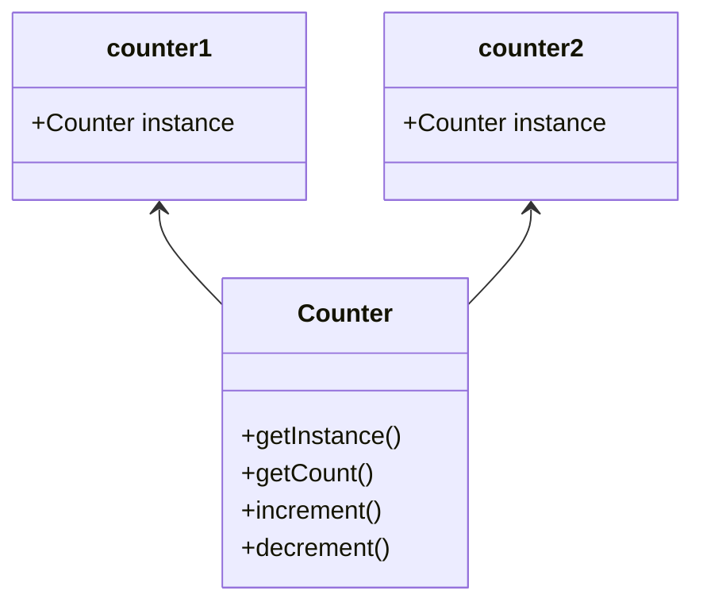

# singleton

_Singletons_ são classes que podem ser instanciadas uma única vez e podem ser acessadas globalmente. Essa _instância única_ pode ser compartilhada em todo o nosso aplicativo, o que torna os _Singletons_ excelentes para gerenciar o estado global em um aplicativo.

Primeiro, vamos dar uma olhada no que pode ser um _singleton_ usando uma classe ES2015. Para este exemplo, vamos criar uma classe `Counter` que tenha:

- um método `getInstance` que retorna o valor da instância
- um método `getCount` que retorna o valor atual da variável do contador
- um método `increment` que aumenta o valor do contador em um
- um método `decrement` que diminui o valor do contador em um

```js
let counter = 0;

class Counter {
  getInstance() {
    return this;
  }

  getCount() {
    return counter;
  }

  increment() {
    return ++counter;
  }

  decrement() {
    return --counter;
  }
}
```

No entanto, essa classe não atende aos critérios de um _Singleton_! Um _Singleton_ só deve poder ser **instanciado uma vez**. Atualmente, podemos criar várias instâncias da classe `Counter`.

```js
let counter = 0;

class Counter {
  getInstance() {
    return this;
  }

  getCount() {
    return counter;
  }

  increment() {
    return ++counter;
  }

  decrement() {
    return --counter;
  }
}

const counter1 = new Counter();
const counter2 = new Counter();

console.log(counter1.getInstance() === counter2.getInstance()); // false
```

Ao chamar o **novo** método duas vezes, acabamos de definir `counter1` e `counter2` como instâncias diferentes. Os valores retornados pelo método `getInstance` em `counter1` e `counter2` efetivamente retornaram referências a instâncias diferentes: eles não são estritamente iguais!



Vamos nos certificar de que apenas **uma** instância da classe `Counter` possa ser criada.

Uma maneira de garantir que apenas uma instância possa ser criada é criar uma variável chamada `instance`. No construtor de `Counter`, podemos definir `instance` igual a uma referência à instância quando uma nova instância for criada. Podemos evitar novas instanciações verificando se a variável `instance` já tem um valor. Se esse for o caso, uma instância já existe. Isso não deve acontecer: um erro deve ser lançado para que o usuário saiba.

```js
let instance;
let counter = 0;

class Counter {
  constructor() {
    if (instance) {
      throw new Error('You can only create one instance!');
    }
    instance = this;
  }

  getInstance() {
    return this;
  }

  getCount() {
    return counter;
  }

  increment() {
    return ++counter;
  }

  decrement() {
    return --counter;
  }
}

const counter1 = new Counter();
const counter2 = new Counter();
// Error: You can only create one instance!
```

Perfeito! Não podemos mais criar várias instâncias.

Vamos exportar a instância do `Counter` do arquivo `counter.js`. Mas antes de fazer isso, devemos **congelar** a instância também. O método `Object.freeze` garante que o código consumidor não possa modificar o _Singleton_. As propriedades da instância congelada não podem ser adicionadas ou modificadas, o que reduz o risco de sobrescrever acidentalmente os valores no _Singleton_.

```js
let instance;
let counter = 0;

class Counter {
  constructor() {
    if (instance) {
      throw new Error('You can only create one instance!');
    }
    instance = this;
  }

  getInstance() {
    return this;
  }

  getCount() {
    return counter;
  }

  increment() {
    return ++counter;
  }

  decrement() {
    return --counter;
  }
}

const singletonCounter = Object.freeze(new Counter());
export default singletonCounter;
```

Vamos dar uma olhada em um aplicativo que implementa o exemplo do `Counter`. Temos os seguintes arquivos:

- `counter.js`: contém a classe `Counter` e exporta uma **instância** de `Counter` como sua exportação padrão
- `index.js`: carrega os módulos `redButton.js` e `blueButton.js`
- `redButton.js`: importa o `Counter` e adiciona o método de `increment` do `Counter` como um ouvinte de eventos para o botão **vermelho** e registra o valor atual do `counter` invocando o método `getCount`
- `blueButton.js`: importa o `Counter` e adiciona o método de `increment` do `Counter` como um ouvinte de eventos para o botão **azul** e registra o valor atual do `counter` invocando o método `getCount`

Tanto o `blueButton.js` quanto o `redButton.js` importam a mesma instância do `counter.js`. Essa instância é importada como `Counter` em ambos os arquivos.
