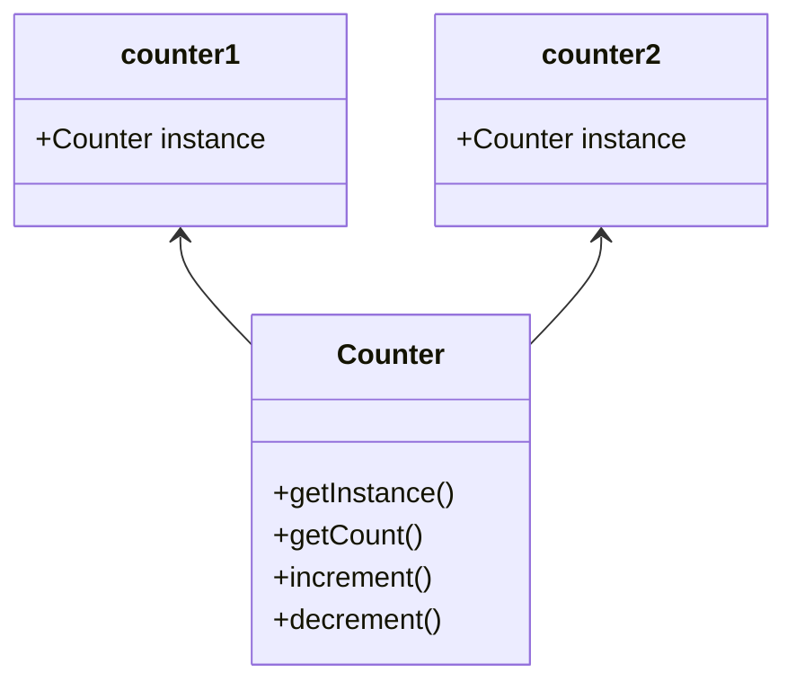

# singleton

_Singletons_ são classes que podem ser instanciadas uma única vez e podem ser acessadas globalmente. Essa _instância única_ pode ser compartilhada em todo o nosso aplicativo, o que torna os _Singletons_ excelentes para gerenciar o estado global em um aplicativo.

Primeiro, vamos dar uma olhada no que pode ser um _singleton_ usando uma classe ES2015. Para este exemplo, vamos criar uma classe `Counter` que tenha:

- um método `getInstance` que retorna o valor da instância
- um método `getCount` que retorna o valor atual da variável do contador
- um método `increment` que aumenta o valor do contador em um
- um método `decrement` que diminui o valor do contador em um

```js
let counter = 0;

class Counter {
  getInstance() {
    return this;
  }

  getCount() {
    return counter;
  }

  increment() {
    return ++counter;
  }

  decrement() {
    return --counter;
  }
}
```

No entanto, essa classe não atende aos critérios de um _Singleton_! Um _Singleton_ só deve poder ser **instanciado uma vez**. Atualmente, podemos criar várias instâncias da classe `Counter`.

```js
let counter = 0;

class Counter {
  getInstance() {
    return this;
  }

  getCount() {
    return counter;
  }

  increment() {
    return ++counter;
  }

  decrement() {
    return --counter;
  }
}

const counter1 = new Counter();
const counter2 = new Counter();

console.log(counter1.getInstance() === counter2.getInstance()); // false
```

Ao chamar o **novo** método duas vezes, acabamos de definir `counter1` e `counter2` como instâncias diferentes. Os valores retornados pelo método `getInstance` em `counter1` e `counter2` efetivamente retornaram referências a instâncias diferentes: eles não são estritamente iguais!


